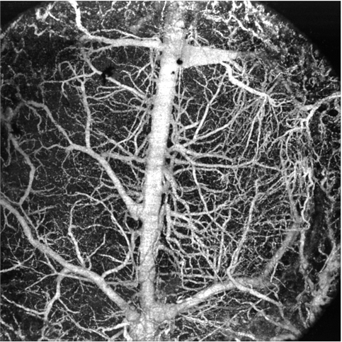

oct-cbort
===========================================

A python package for reconstructing raw OCT/OFDI data from the Center for Biomedical OCT Research @ The Wellman Center for Photomedicine.
https://octresearch.org/

The library was developed by the labs of Professor Ben Vakoc and Professor Brett Bouma.

Contributions:

* Primary Author: Damon DePaoli <ddepaoli@mgh.harvard.edu / depaoli9@gmail.com>

Contents
---------

.. toctree::
   :maxdepth: 1

   README
   /API/index
   examples
   tutorials

Indices and tables
---------------------

* :ref:`genindex`
* :ref:`modindex`
* :ref:`search`

